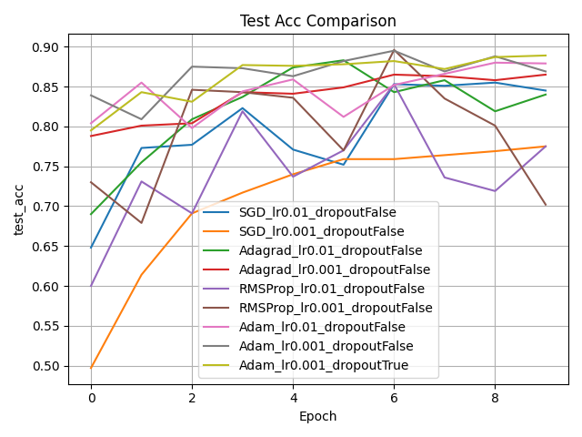
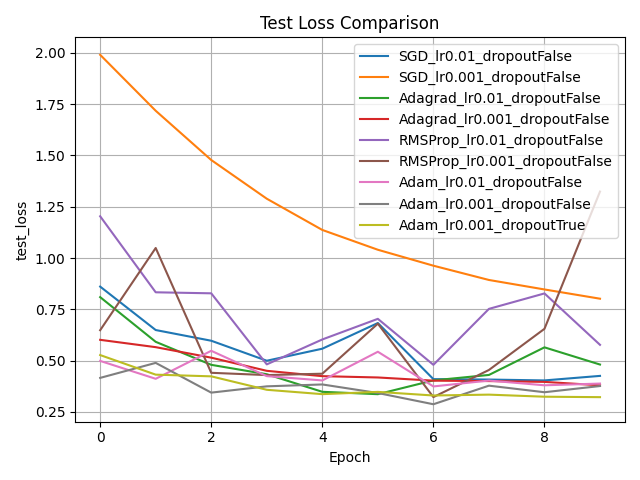
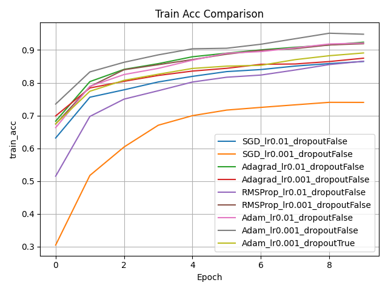
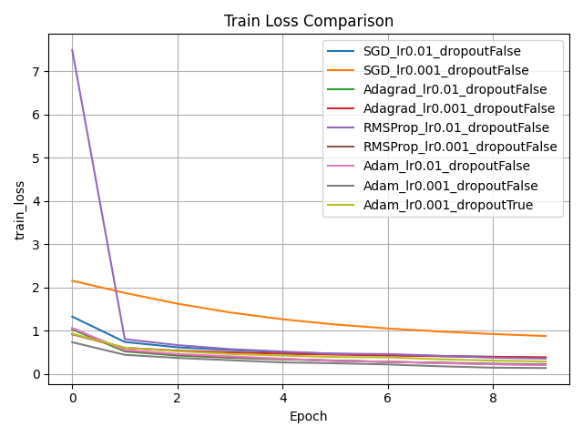

# MNIST 优化器对比实验

本项目旨在通过经典卷积神经网络结构，对比多种主流优化器在手写数字识别任务中的表现，包括收敛速度、最终精度、损失变化等多个维度的实验分析与可视化。

## 🎯 实验目标

- 掌握神经网络基本结构：卷积层、BatchNorm、激活函数、全连接层等。
- 理解交叉熵损失函数及四种主流优化器的原理：
  - **SGD**（随机梯度下降）
  - **Adagrad**
  - **RMSProp**
  - **Adam**
- 对比不同优化器在 MNIST 小样本任务上的表现差异。
- 探索学习率变化、Dropout 正则化、收敛速度等影响因素。

## 🧠 网络结构

- 输入：28×28 灰度图像
- 卷积块 1：`Conv2d(1, 32, 3x3)` → `BatchNorm2d(32)` → `ReLU` → `MaxPool2d(2)`
- 卷积块 2：`Conv2d(32, 64, 3x3)` → `BatchNorm2d(64)` → `ReLU` → `MaxPool2d(2)`
- 全连接层 1：`Linear(64×5×5, 128)` → `ReLU`
- 全连接层 2：`Linear(128, 10)`
- 可选：`Dropout(0.5)`（用于正则化分析）

## 🧪 实验设置

- 数据集：MNIST
  - 训练集：5000 张
  - 测试集：1000 张
- 优化器：SGD / Adagrad / RMSProp / Adam
- 学习率：0.01 和 0.001
- 训练轮数：10 Epochs
- 设备支持：CPU / GPU 自动切换
- 可视化：每轮训练与测试准确率和损失曲线
- CPU ：14 核心
- 内存：45 GB
- GPU ：NVIDIA GeForce RTX 3090, 1

## 📈 实验结果展示

- 准确率与损失变化曲线（每种优化器绘图展示）

 



- 收敛速度分析：达到 90% 测试准确率所需轮数
- 结果对比表格，量化不同优化器在最终性能与训练速度上的差异

| 优化器        | 最终测试准确率 | 收敛轮数 | 最终训练损失 |
|---------------|----------------|----------|----------------|
| SGD           | 0.91           | 7        | 0.18           |
| Adam          | 0.94           | 4        | 0.12           |
| ...           | ...            | ...      | ...            |

## 📝 Git相关命令

```bash
git clone https://github.com/yiweinanzi/MNITS_TRAIN.git
```

## ▶️ 运行方式

- 第一次运行所需环境

```bash
#创建虚拟环境
cd MNITS_TRAIN
conda create -n MNIST python==3.8
conda init bash
source ~/.bashrc
```

- 安装所需依赖

```bash
#激活虚拟环境
conda activate MNIST
pip install -r requirements.txt -i https://pypi.tuna.tsinghua.edu.cn/simple
```

- 训练与评估

```bash
python main.py
```

- 可视化结果与loss曲线

```bash
python visualize_saved_results.py
```

## 📁 项目结构说明

```
MNITS_TRAIN/
├── mnist_data
│   ├── t10k-images-idx3-ubyte          # 数据集文件
│   ├── t10k-labels-idx1-ubyte          # 数据集文件
│   ├── train-images-idx3-ubyte         # 数据集文件
│   └── train-labels-idx1-ubyte         # 数据集文件
├── results                             # 结果汇总文件夹
│   ├── logs                            # 训练日志
│   ├── plots                           # 训练结果可视化                     
│   └── records                         # 训练记录文件
├── README.md                           # 项目说明文档（当前文件）
├── custom_loader.py                    # 数据集导入
├── main.py                             # 主程序入口与实验控制
├── model.py                            # 网络结构定义
├── requirements.txt                    # 所需依赖库
├── train_eval.py                       # 训练与评估逻辑
├── utils.py                            # 工具文件
└── visualize_saved_results.py          # 可视化与结果统计工具
```

## 📚 致谢与声明

本项目作为深度学习课程实验作业，欢迎参考与学习。